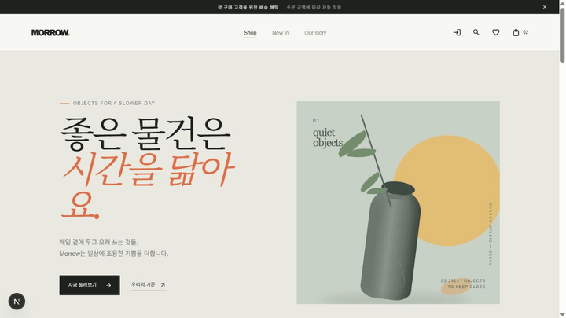

# Intro

AI를 사용한 쇼핑몰 프로젝트입니다. 상품 탐색부터 상품 상세 확인, 회원 기능, 장바구니와 찜 목록, 배송지 및 주문 흐름까지 실제 쇼핑몰 사용 흐름을 기준으로 프론트엔드와 백엔드를 함께 구성했습니다.

## Demo



홈 화면에서 리빙 카테고리를 선택하고 상품 목록과 상품 상세 화면으로 이동하는 과정을 확인할 수 있습니다.

## 주요 기능

- 카테고리 및 상품 목록 조회
- 상품 상세 정보와 재고 상태 표시
- 로그인, 회원가입, 이메일 인증 및 비밀번호 재설정
- 로그인·비로그인 장바구니와 찜 목록
- 배송지 관리 및 주문 준비 흐름
- 서버 API 기반 상품·카테고리·회원·주문 데이터 연동

결제와 소셜 로그인은 구현하지 않았습니다. 프로젝트 초기 목표에서 많이 어긋나기 때문입니다.

## 역할 분담

### AI 담당

- 요구사항을 코드 구조와 사용자 흐름으로 구체화
- Next.js 기반 페이지와 React 컴포넌트 구현
- MUI 및 CSS Module을 활용한 UI 구현과 반응형 스타일 작성
- 백엔드 API 명세에 맞춘 상품, 회원, 장바구니, 찜, 배송지, 주문 기능 연동
- 오류·로딩·인증 상태 처리와 코드 분석 및 리팩터링 제안
- 린트, 빌드, 브라우저 흐름 확인 등 구현 결과 검증

### 프로젝트 담당자

- 서비스 방향, 디자인 기준, 기능 우선순위 결정
- 백엔드 API와 데이터베이스 기능 설계 및 제공
- API 명세와 개발 환경 설정 공유
- 실제 브라우저 사용을 통한 동작·화면 검증과 개선 의견 제시
- 최종 기능 범위와 사용자 경험에 대한 의사결정

## 기술 스택

### Frontend

- Next.js 16
- React 19
- TypeScript
- Material UI

### Backend

- NestJS
- TypeScript
- PostgreSQL
- REST API
- Swagger

## 프로젝트 구조

```text
.
├─ frontend/   # Next.js 쇼핑몰 프론트엔드
├─ backend/    # NestJS API 서버
├─ docs/       # 프로젝트 문서
└─ artifacts/  # 데모 GIF 및 촬영 산출물
```

## 환경 설정

백엔드는 `backend/.env.example`을 참고해 환경 파일을 구성합니다. 실제 데이터베이스 접속 정보와 인증 관련 비밀 값은 저장소에 커밋하지 않아야 합니다.

주요 설정은 다음과 같습니다.

- `DATABASE_URL`: PostgreSQL 연결 문자열
- `PORT`: 백엔드 서버가 사용할 포트
- `FRONTEND_URL`: 이메일 인증 및 비밀번호 재설정 링크에 사용할 프론트엔드 주소
- `SWAGGER_ENABLED`: Swagger 문서 활성화 여부

프론트엔드는 `frontend/.env.local`에 백엔드 주소를 설정합니다.

```env
BACKEND_API_BASE_URL=<backend-origin>
```

`<backend-origin>`에는 백엔드가 실제로 실행되는 프로토콜, 호스트, 포트를 입력합니다.

## 실행 방법

### Backend

```bash
cd backend
npm install
npm run start:dev
```

백엔드의 실제 접속 주소와 포트는 `PORT` 설정 및 실행 환경에 따라 달라집니다. API 문서는 백엔드 주소 뒤에 `/docs`를 붙여 확인할 수 있습니다.

### Frontend

```bash
cd frontend
npm install
npm run dev
```

프론트엔드의 실제 접속 주소는 Next.js 개발 서버가 실행될 때 터미널에 표시되는 주소를 사용합니다. 프론트엔드와 백엔드의 주소가 서로 다르다면 `BACKEND_API_BASE_URL`과 `FRONTEND_URL`도 그에 맞춰 설정해야 합니다.
